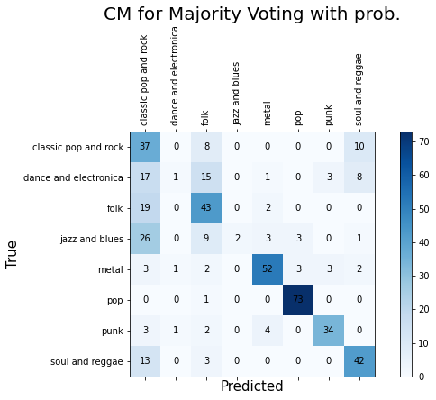

## Music Genre Classification
<em>In recent year, Music Information Retrieval (MIR) which draws from musicology, signal processing, and artificial intelligence is more popular. A long line of work addresses problems including music understanding, automatic music annotation, and other problems.</em>

<em>In this report, we describe the dataset which contains metadata features, tags features and audio features from The million song dataset and Capturing the temporal domain in Echonest Features for improved classification effectiveness.</em>

### Hypothesis and Proposal
1. We proposed a combination resul from model-blending which uses different models to optimize the performance based on each group of features (metadata, tags, and audio).
2. We hypothesize that combining three more accurate models from different types of features separately could give us better performance rather than using a specific model to predict the whole dataset.

### Implementation
1. Read csv data files which include train, validate and test dataset
2. Transfer labels from categorical to numerical for easy computation
    * As report mentioned, we split features into tags features, metadata features and audio features.

3. Dealing with tags features
    * We try to get every single tag in tags features and use Bag of words method to transfer tags features into numeric value (how many times this word appear in this instance)
4. Train and evaluate different models
5. Dealing with metadata features
    * We try to compare each model based on different conditions (features selection, cross validation
6. Train and evaluate different models
7. Dealing with audio features
    * We try to compare each model based on different K-folds CV and yet normalized or not
8. Train and evaluate different models
9. Testing
    * In testing, we will combine three better methods using two majority voting approaches to do our testing on validation dataset.
10. Confusion matrices based on two different majority voting approaches
11. Final result and output for kaggle competition

### Combination and Results
